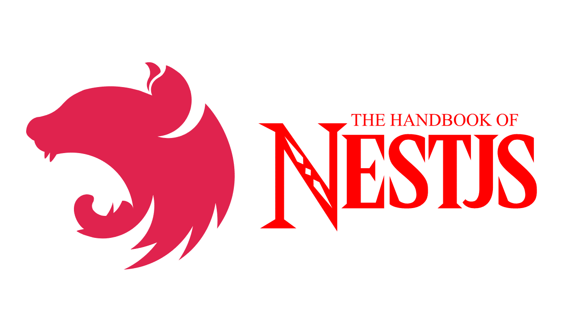

# About Me

I'm Shota Nukumizu. I'm 21 years old and a student programmer. I'm in my third year at Kyushu University. I have practiced coding and launched web development since March 1, 2021. I usually share the charm and the skills of web development through social media like Twitter and [my tech blog](https://shotanukumizu-1000.hatenablog.com/) in Japanese. 

I started sharing the skills of web development in order to share my knowledge, experience and passions for web development. I usually code for 2 hours at least. I'm very interested in backend development. Especially I like Django REST Framework. I want to become a full-stack developer.

# My Status

&nbsp;

# My Best Languages, Frameworks, and Tools

   

# Programming Languages, Frameworks and Tools

   

# NOW TRAINING

   

# My HandBook

[The Handbook of NestJS](https://shota-nukumizu.gitbook.io/nestjs-handbook/)：A technical book on NestJS written in Japanese, edited by Gitbook and released in beta on 15 June. It is planned to re-release the book in an open source form that anyone can write.

# Connect with me:

